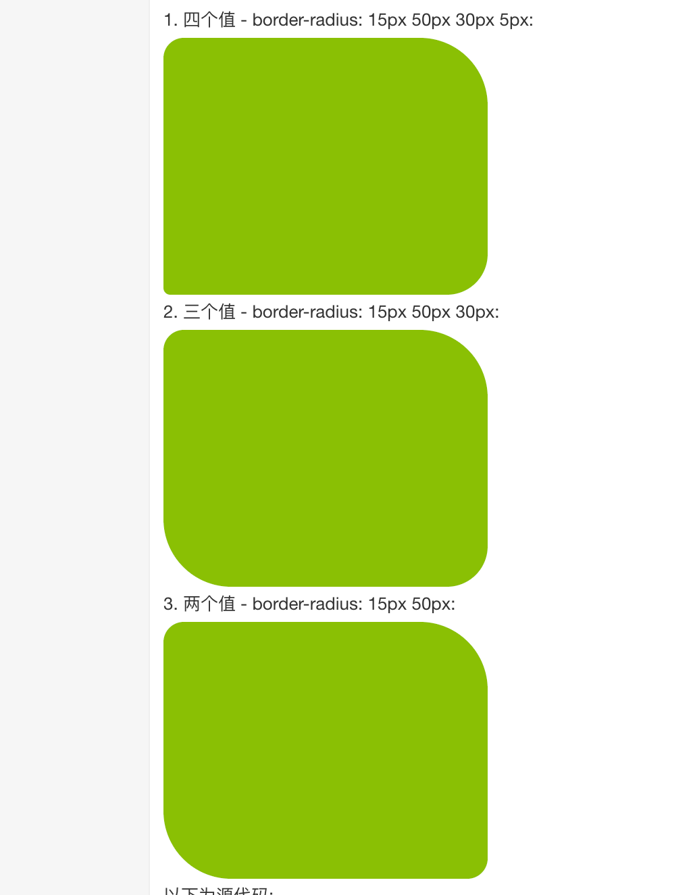

# CSS3 

## boder

### border-shadow
- h-width: 水平方向上的大小（左负右正）px

- v-height: 垂直方向上的大小（上负下正）px

- blur(🉑️): 模糊距离 px

- spread(🉑️): 扩散程度 px

- color(🉑️): 颜色

- inset(🉑️): 从外层的阴影（开始时）改变阴影内侧阴影

```css
border-shadow: h-width v-height blur spread color inset;
```

### boder-image
```css
border-image: source slice width outset repeat|initial|inherit;

/* 默认值 */
border-image: none 100% 1 0 stretch;
```

### border-radius

- 四个值: 第一个值为左上角，第二个值为右上角，第三个值为右下角，第四个值为左下角。

- 三个值: 第一个值为左上角, 第二个值为右上角和左下角，第三个值为右下角

- 两个值: 第一个值为左上角与右下角，第二个值为右上角与左下角

- 一个值： 四个圆角值相同



## background
[background](https://www.runoob.com/css3/css3-backgrounds.html)

### 渐变
[具体](https://www.runoob.com/css3/css3-gradients.html)

- 线性渐变（Linear Gradients）- 向下/向上/向左/向右/对角方向

- 径向渐变（Radial Gradients）- 由它们的中心定义

```css
background: linear-gradient(direction, color-stop1, color-stop2, ...);

background: radial-gradient(center, shape size, start-color, ..., last-color);
```

## 文字

[具体](https://www.runoob.com/css3/css3-text-effects.html)

- text-overflow
  - clip	修剪文本。
  - ellipsis	显示省略符号来代表被修剪的文本。
  - string	使用给定的字符串来代表被修剪的文本。

- word-break
  - normal	使用浏览器默认的换行规则。
  - break-all	允许在单词内换行。
  - keep-all	只能在半角空格或连字符处换行。

- word-wrap
  - normal	只在允许的断字点换行（浏览器保持默认处理）。
  - break-word	在长单词或 URL 地址内部进行换行。

- text-shadow (同 border-shadow)

## 自定义字体 @font-face
[具体](https://www.runoob.com/css3/css3-fonts.html)
```css
@font-face
{
    font-family: myFirstFont;
    src: url(sansation_light.woff);
}
 
div
{
    font-family:myFirstFont;
}
```

## transform
### 2D 转化
[具体](https://www.runoob.com/css3/css3-2dtransforms.html)

- translate(x, y) 元素距离本身位置向右，向下 偏移位置

- rotate(deg) 元素 bottom 距离水平线向右旋转的角度 deg

- scale(x, y || all) 元素本身缩放大小(x, y)或者(all)，元素实际所占位置大小不变

- skew(x, y) 元素在 x，y轴倾斜的角度

- matrix() 合并属性

### 3D 转化

[具体](https://www.runoob.com/css3/css3-3dtransforms.html)

- translate3d(X, Y, Z)

- scale3d(X, Y, Z)

- rotate3d(X, Y, Z)

## transition 过渡
[具体](https://www.runoob.com/cssref/css3-pr-transition-timing-function.html)

```css
transition: property duration timing-function delay;
```

- property 属性

- duration 时间

- timing-function 指定transition效果的转速曲线

  - linear	规定以相同速度开始至结束的过渡效果（等于 cubic-bezier(0,0,1,1)）。
  - ease	规定慢速开始，然后变快，然后慢速结束的过渡效果（cubic-bezier(0.25,0.1,0.25,1)）。
  - ease-in	规定以慢速开始的过渡效果（等于 cubic-bezier(0.42,0,1,1)）。
  - ease-out	规定以慢速结束的过渡效果（等于 cubic-bezier(0,0,0.58,1)）。
  - ease-in-out	规定以慢速开始和结束的过渡效果（等于 cubic-bezier(0.42,0,0.58,1)）。
  - cubic-bezier(n,n,n,n)	在 cubic-bezier 函数中定义自己的值。可能的值是 0 至 1 之间的数值。

- delay 定义transition效果开始的时候

## 动画

[具体]()

```css
div
{
	width:100px;
	height:100px;
	background:red;
	animation:myfirst 5s;
	-webkit-animation:myfirst 5s; /* Safari and Chrome */
}

@keyframes myfirst
{
	from {background:red;}
	to {background:yellow;}
}

@-webkit-keyframes myfirst /* Safari and Chrome */
{
	from {background:red;}
	to {background:yellow;}
}
```

- @keyframes name 定义动画名称 及动画变化内容
- animation 指定动画

```css
animation: name duration timing-function delay iteration-count direction fill-mode play-state;
```

- animation-name	指定要绑定到选择器的关键帧的名称

- animation-duration	动画指定需要多少秒或毫秒完成

- animation-timing-function	设置动画将如何完成一个周期

- animation-delay	设置动画在启动前的延迟间隔。

- animation-iteration-count	定义动画的播放次数。

- animation-direction	指定是否应该轮流反向播放动画。
    - normal	默认值。动画按正常播放。
    - reverse	动画反向播放。
    - alternate	动画在奇数次（1、3、5...）正向播放，在偶数次（2、4、6...）反向播放。
    - alternate-reverse	动画在奇数次（1、3、5...）反向播放，在偶数次（2、4、6...）正向播放。
    - initial	设置该属性为它的默认值。	
    - inherit	从父元素继承该属性。

- animation-fill-mode	规定当动画不播放时（当动画完成时，或当动画有一个延迟未开始播放时），要应用到元素的样式。

- animation-play-state	指定动画是否正在运行或已暂停。