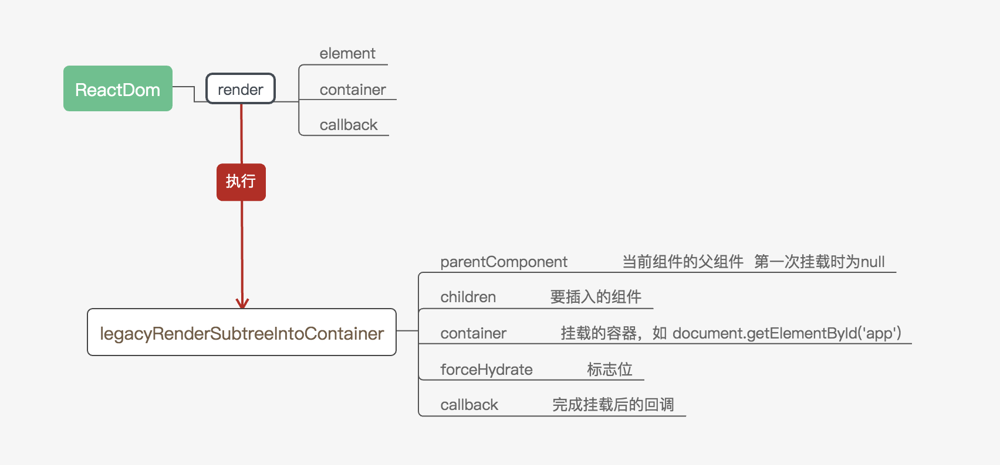
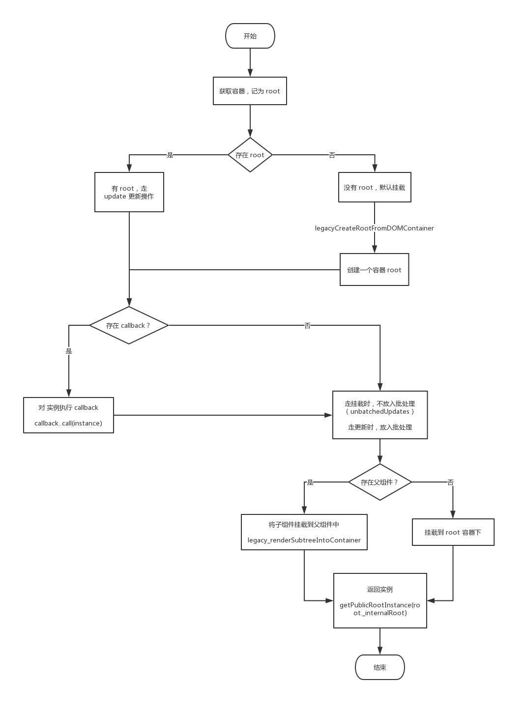

> 在挂载根组件时，通常通过手动调用 React.render(<App />, document.getElementById("root"))，那 render 到底做了 什🐎 呢？

# ReactDOM
```javascript
const ReactDOM: Object = {
  // react16 中新，用于将 dom 添加在组件之外
  createPortal,

  // 查找 Dom 节点
  findDOMNode(
    componentOrElement: Element | ?React$Component<any, any>,
  ): null | Element | Text {
    return findHostInstance(componentOrElement);
  },

  // 用于服务器渲染
  hydrate(element: React$Node, container: DOMContainer, callback: ?Function) {
    return legacyRenderSubtreeIntoContainer(
      null,
      element,
      container,
      true,
      callback,
    );
  },

  // 🏆 关键的 render 函数
  render(
    element: React$Element<any>,
    container: DOMContainer,
    callback: ?Function,
  ) {
    return legacyRenderSubtreeIntoContainer(
      null,
      element,
      container,
      false,
      callback,
    );
  },
  // ...
};
```
从上面代码中可以看到，在 ReactDOM 中 render 是通过调用 legacyRenderSubtreeIntoContainer 方法来实现的，所以就先来看看它的实现 🏃‍♀️。

## legacyRenderSubtreeIntoContainer

由函数名得该函数的功能，将子树 **render** 到容器中✌️。
下图为 ReactDOM 的简要关系图：



```javascript
function legacyRenderSubtreeIntoContainer(
  parentComponent: ?React$Component<any, any>, // 父组件
  children: ReactNodeList, // 需要挂载的子组件 

  container: DOMContainer, // 容器，挂载点，如 document.getElementBy('app')
  forceHydrate: boolean, // 是否为服务器渲染
  callback: ?Function, // 执行后的回调函数
) {

  // 获取 container 的 root 挂载点
  let root: Root = (container._reactRootContainer: any);

  // 如果没有 root，则认为需要挂载
  if (!root) { // 记为 🌿
    // 创建 container，使用：legacyCreateRootFromDOMContainer 1⃣️
    root = container._reactRootContainer = legacyCreateRootFromDOMContainer(
      container,
      forceHydrate,
    );
    // 在 instance 上执行 callback
    if (typeof callback === 'function') {
      const originalCallback = callback;
      callback = function() {
        // 获取当前 this (即当前实例对象)
        const instance = getPublicRootInstance(root._internalRoot);
        originalCallback.call(instance);
      };
    }
    // 初始化的挂载，不需要放入批处理中
    // 不加入批处理队列 使用 unbatchedUpdates 2⃣️
    unbatchedUpdates(() => {
      // 如果存在父组件 将子组件装入父组件中
      if (parentComponent != null) {
        root.legacy_renderSubtreeIntoContainer(
          parentComponent,
          children,
          callback,
        );
      } else {
        // 将子组件直接渲染进 root container
        root.render(children, callback);
      }
    });
  } else { // 回到 🌿
    // 存在 root 则为更新操作
    // 同理为 callback 绑定 this
    if (typeof callback === 'function') {
      const originalCallback = callback;
      callback = function() {
        const instance = getPublicRootInstance(root._internalRoot);
        originalCallback.call(instance);
      };
    }

    // 有parentComponent 将 subTree 渲染进父组件
    if (parentComponent != null) {
      root.legacy_renderSubtreeIntoContainer( // 3⃣️ 如果存在父组件 将子组件装入父组件中
        parentComponent,
        children,
        callback,
      );
    } else {
      // 渲染进 root container 中
      root.render(children, callback);
    }
  }
  // 返回实例
  return getPublicRootInstance(root._internalRoot);
}
```

由代码可以得出，当调用该函数时，如果组件没有 root，则认为是首次挂载，为其创建 root 并且不进入批处理队列 => 调用 unbatchedUpdates 挂载到相应的位置；否则的话，会被加入到批处理队列中，等待主线程空档期执行。

下图为 legacyRenderSubtreeIntoContainer 的流程图：



- legacyCreateRootFromDOMContainer 1⃣️ : 
通过 DOMContainer 创建 root container:

```javascript
function legacyCreateRootFromDOMContainer(
  container: DOMContainer,
  forceHydrate: boolean,
): Root {
  const shouldHydrate =
    forceHydrate || shouldHydrateDueToLegacyHeuristic(container);
  // 清除 container 中的内容
  if (!shouldHydrate) {
    let warned = false;
    let rootSibling;
    // 移除 container 中的节点
    while ((rootSibling = container.lastChild)) {
      container.removeChild(rootSibling);
    }
  }

  // 默认不为同步
  const isConcurrent = false;
  // 返回一个 ReactRoot 对象，见下 *ReactRoot*
  return new ReactRoot(container, isConcurrent, shouldHydrate);
}
```
- unbatchedUpdates 2⃣️ : 
- legacy_renderSubtreeIntoContainer 3⃣️ : 见 ReactRoot.legacy_renderSubtreeIntoContainer

## ReactRoot
```javascript
function ReactRoot(
  container: DOMContainer,
  isConcurrent: boolean,
  hydrate: boolean,
) {
  const root = createContainer(container, isConcurrent, hydrate);
  this._internalRoot = root;
}

ReactRoot.prototype.render = function(
  children: ReactNodeList,
  callback: ?() => mixed,
): Work {
  const root = this._internalRoot;
  const work = new ReactWork(); // 创建一个 work
  callback = callback === undefined ? null : callback;
  if (__DEV__) {
    warnOnInvalidCallback(callback, 'render');
  }
  if (callback !== null) {
    work.then(callback); // 向 work 中加入 cb
  }
  updateContainer(children, root, null, work._onCommit); // 更新？
  return work; // 返回 work
};

ReactRoot.prototype.unmount = function(callback: ?() => mixed): Work {
  const root = this._internalRoot;
  const work = new ReactWork();
  callback = callback === undefined ? null : callback;
  if (__DEV__) {
    warnOnInvalidCallback(callback, 'render');
  }
  if (callback !== null) {
    work.then(callback);
  }
  updateContainer(null, root, null, work._onCommit);
  return work;
};

// 更新 container
ReactRoot.prototype.legacy_renderSubtreeIntoContainer = function(
  parentComponent: ?React$Component<any, any>,
  children: ReactNodeList,
  callback: ?() => mixed,
): Work {
  const root = this._internalRoot; // 当前挂载点
  const work = new ReactWork();
  callback = callback === undefined ? null : callback;
  if (__DEV__) {
    warnOnInvalidCallback(callback, 'render');
  }
  if (callback !== null) {
    work.then(callback);
  }
  updateContainer(children, root, parentComponent, work._onCommit);
  return work;
};
// 调用 legacy_renderSubtreeIntoContainer，render 和 unmount 都新建一个work
// 并将 cb 加入 callbacks 中（因为其 _onCommit 为 false）

ReactRoot.prototype.createBatch = function(): Batch {
  const batch = new ReactBatch(this);
  const expirationTime = batch._expirationTime;

  const internalRoot = this._internalRoot;
  const firstBatch = internalRoot.firstBatch;
  if (firstBatch === null) {
    internalRoot.firstBatch = batch;
    batch._next = null;
  } else {
    // Insert sorted by expiration time then insertion order
    let insertAfter = null;
    let insertBefore = firstBatch;
    while (
      insertBefore !== null &&
      insertBefore._expirationTime >= expirationTime
    ) {
      insertAfter = insertBefore;
      insertBefore = insertBefore._next;
    }
    batch._next = insertBefore;
    if (insertAfter !== null) {
      insertAfter._next = batch;
    }
  }

  return batch;
};
```
## ReactWork
## ReactBatch
## ReactDOM
# render 🌿
